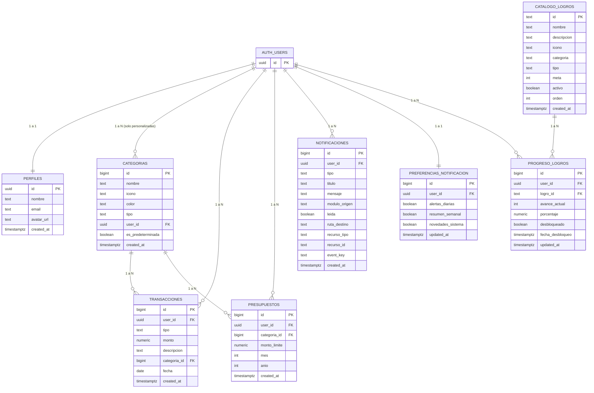

# Diagrama ER - FinanzasU

## Objetivo

Este documento presenta el modelo entidad-relacion (ER) actual de la base de datos de FinanzasU,
alineado con los scripts SQL de migracion y politicas RLS.

> Nota: este ER refleja el estado actual de la base de datos después de las migraciones 001 a 005.

## Diagrama entidad-relacion

## Reglas de negocio clave

- Categorias globales del sistema:
  - `categorias.user_id IS NULL`
  - `categorias.es_predeterminada = true`
- Categorias personalizadas:
  - `categorias.user_id = auth.uid()`
- Presupuesto unico por periodo:
  - `UNIQUE (user_id, categoria_id, mes, anio)`
- Preferencias de notificacion por usuario:
  - `UNIQUE (user_id)`
- Progreso de logros por usuario y logro:
  - `UNIQUE (user_id, logro_id)`
- Validaciones de integridad:
  - `transacciones.monto > 0`
  - `presupuestos.monto_limite > 0`
  - `presupuestos.mes BETWEEN 1 AND 12`
- Notificaciones sin duplicados por evento:
  - `event_key` se usa para evitar repeticiones en ventanas de tiempo definidas

## Comportamiento de claves foraneas

- `perfiles.id -> auth.users.id` con `ON DELETE CASCADE`
- `categorias.user_id -> auth.users.id` con `ON DELETE CASCADE`
- `transacciones.user_id -> auth.users.id` con `ON DELETE CASCADE`
- `transacciones.categoria_id -> categorias.id` con `ON DELETE SET NULL`
- `presupuestos.user_id -> auth.users.id` con `ON DELETE CASCADE`
- `presupuestos.categoria_id -> categorias.id` con `ON DELETE CASCADE`
- `notificaciones.user_id -> auth.users.id` con `ON DELETE CASCADE`
- `preferencias_notificacion.user_id -> auth.users.id` con `ON DELETE CASCADE`
- `progreso_logros.user_id -> auth.users.id` con `ON DELETE CASCADE`
- `progreso_logros.logro_id -> catalogo_logros.id` con `ON DELETE CASCADE`

## Seguridad (RLS)

RLS esta habilitado en:

- `public.perfiles`
- `public.categorias`
- `public.transacciones`
- `public.presupuestos`
- `public.notificaciones`
- `public.preferencias_notificacion`
- `public.catalogo_logros`
- `public.progreso_logros`

Principio aplicado:

- Cada usuario solo puede operar sobre sus propios datos.
- En categorias, lectura combinada de categorias propias + categorias globales.
- El catálogo de logros es de solo lectura para todos los usuarios autenticados.

## Fuente tecnica

Este diagrama se deriva de:

- `supabase/migrations/001_initial_schema.sql`
- `supabase/migrations/002_notifications.sql`
- `supabase/migrations/003_logros.sql`
- `supabase/migrations/004_notifications_preferences.sql`
- `supabase/policies.sql`
